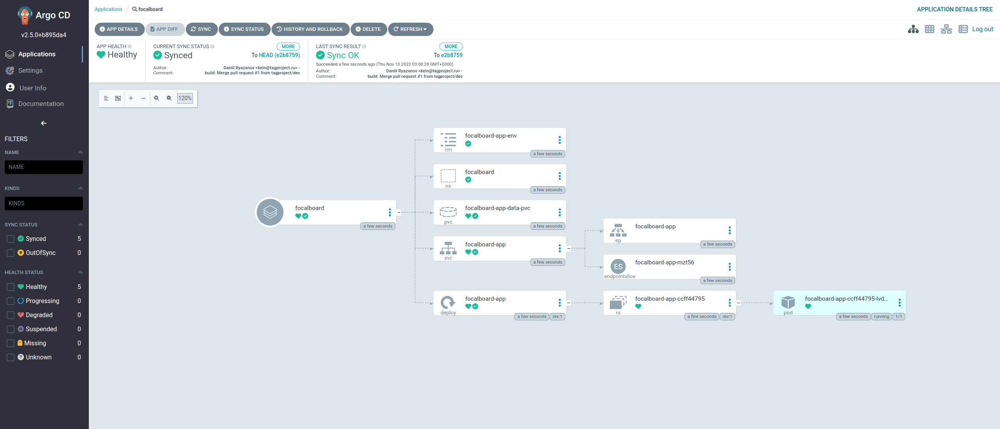

# Kubernetes manifests for Focalboard deployment

Deploy [Focalboard](https://github.com/mattermost/focalboard) with ArgoCD and Kustomization.

## Prepare

In manifest use `namespace: focalboard` and `namePrefix: focalboard-`, you can change it in `kustomization.yaml`:

```yaml
namespace: focalboard
namePrefix: focalboard-
```

In my case i have [Rancher Local Path Provisioner](https://github.com/rancher/local-path-provisioner) and use sqlite3 `db`. You can describe you own `PersistentVolumesClaims`:

- persistentvolumeclaim/focalboard-app-data-pvc - `10Gi`

## Deploy Focalboard application with ArgoCD

Install ArgoCD and download ArgoCD CLI, see [getting started section](https://argo-cd.readthedocs.io/en/stable/getting_started/).

```sh
argocd app create focalboard \
  --project default \
  --repo https://github.com/tagproject/k8s-focalboard.git \
  --path ./ \
  --dest-server https://kubernetes.default.svc \
  --dest-namespace focalboard \
  --sync-policy automated
```

<details>
<summary>After synchronization, you will see something like this in ArgoCD UI</summary>



</details>

Get `focalboard-frontend` `EXTERNAL-IP` and open Focalboard UI with you IP `http://192.168.0.x:80`:

```sh
kubectl get svc/focalboard-app -n focalboard
```

|                |              |            |             |              |     |
| -------------- | ------------ | ---------- | ----------- | ------------ | --- |
| NAME           | TYPE         | CLUSTER-IP | EXTERNAL-IP | PORT(S)      | AGE |
| focalboard-app | LoadBalancer | 10.233.x.x | 192.168.0.x | 80:31231/TCP | 1m  |
